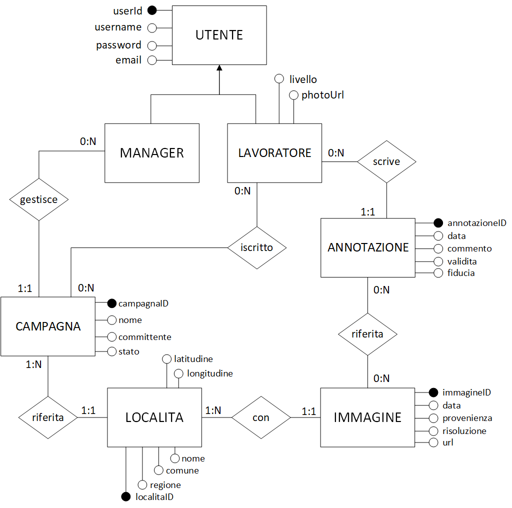

# dump-inspectors

### Specifiche di progetto
Source: **[ELABORATO 2019](Elaborato_2018-19.pdf)**

Il progetto consiste nello sviluppo di un'applicazione web per la convalida di immagini aeree di località a rischio per la presenza di discariche illegali, con un approccio di crowdsourcing. Il Manager crea una campagna di crowdsourcing, carica al suo interno un insieme di località a rischio e associa a ogni località dei dati descrittivi e una o più immagini aeree. Dopo aver caricato località, immagini e i dati, il Manager avvia la campagna di crowdsourcing, cui vari lavoratori possono prendere parte per classificare le immagini come rappresentanti vere discariche o come "falsi allarmi".

I file di documentazione sono dentro la cartella ```doc```.





### Ipotesi di progetto:

- Le campagne sono completamente scorrelate fra loro: un manager non può vedere località degli altri manager, ne può vederne le immagini. Devono esserci più località differenti nel database anche se condividono le stesse coordinate. **(CONFERMATO DAL PROF)**

### VIEW - Validazione:

- *login:* **lato client** con validazione tramite HTML5, **lato server** ...
- *registrazione*: **lato client** ... , **lato server** ...

## Initial configuration:

#### web.xml
```web.xml``` file is in **.gitignore**, copy it in ```WEB-INF``` folder and personalize it.

## Resources:
- Thymeleaf docs su [login/registration page](https://www.thymeleaf.org/doc/articles/thvsjsp.html)
- Per l'implementazione della [mappa interattiva](https://leafletjs.com/)
- [CSS Grid](<https://css-tricks.com/snippets/css/complete-guide-grid/>) per l'impaginazione
- Esempio [radio button carini](https://codepen.io/skeddles/pen/PbROLK)

## Tools:

#### IFML
- IFML eclipse plug-in at: <http://ifml.github.io/>
- Online editor at: <http://editor.ifmledit.org/>

#### ER Diagram

- Microsoft Visio ([file da importare](doc/shapes/ER_Model_Shapes.vssx) per le forme)